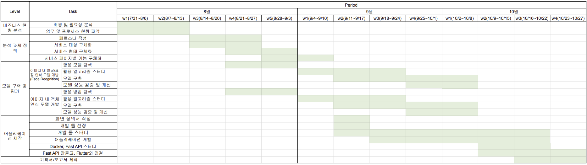

## 1. 프로젝트 시작

4주간의 교육을 마치고 팀 프로젝트로 안전한 SNS 사용을 위한 개인정보 마스킹 어플 가리다(GaRiDa)를 개발했다.@

그동안 학교 강의만 따라가고 스스로 코딩을 해본적이 없었기에 프로젝트 경험을 쌓을 수 있다는 것에 설레면서도 제대로 된 프로젝트를 해본 적이 없다는 것이 팀에 큰 걸림돌이 되지 않을까 하는 걱정이 컸었다.

더군다나 처음으로 대외활동에 참여하고 학교 내 사람들이 아닌 분들과 팀을 하다보니 제대로 하고 싶은 마음이 컸다.

 

## 2. 프로젝트 주제 선정

사람들마다 각자 하고 싶은 주제가 있고, 각자만의 아이디어가 있다.  
각자만의 아이디어를 팀원들에게 공유하고 회의를 거치면서 아이디어를 구체화해간다.

우리 팀은 우선 대분류를 정하였다.
AI 보안 개인정보반으로 모였기에  
**AI 보안과 개인정보 보호** 주제에 부합하면서 금융 관련한 아이디어를 짜기로 하였다.  
각자 아이디어를 구상한 후 맞는 첫 회의에서 다양한 의견들이 나왔다.

그 중 해보고 싶은 예비 주제들이 많이 나왔기에 쉽사리 결정하지 못했다.  
그래서 우리 팀은 교육 받을 때 교육해주신 박사님께 자문하였다.  
박사님께서는 여러 주제 중 두 가지를 선정해주셨고, 우리끼리 최종적으로 회의를 거쳐 주제를 선정하였다.

그렇게 정해진 주제로 회의를 진행하고 후에 KISIA(한국정보보호산업협회)에서 멘토님을 정해주셨다.

멘토님께서 팀에 들어오신 후로 정말 많은 것이 바뀌고 구체화되었다.  
다소 불투명했던 주제에 멘토님께서 페르소나를 작성해보는 것이 좋을거라고 해주셨고, 페르소나를 작성하면서 주제를 구체화해갔다.

페르소나를 작성하다보니 왜 필요한지, 어떤 기능이 들어가야 할지, 타켓팅을 어떻게 할 지를 정하게 되면서 주제를 확정지었다.

그렇게 정해진 우리 팀의 주제는 **안전한 SNS 사용을 위한 개인정보 마스킹 어플**이였다.

먼저, 어떤 정보를 마스킹할 것인가  
실제 개인정보가 침해당한 사례들을 찾아보면서 셰어런팅으로 인한 어린 친구들의 개인정보 침해 위험이 높아지고 있다는 것을 알게되었다.

이것을 시작으로 아이의 **얼굴, 배경, 옷**을 마스킹하는 것으로 범위를 좁혀나갔다.

다음으로, 기존 서비스들을 찾아보았다.
기존 서비스들은 SNS에 마스킹된 사진을 올리려면 마스킹 어플을 추가적으로 사용해야 하고, 자동 모자이크 영역과 개수가 한정되어 있으며 모자이크할 영역을 유저가 직접 드래그해 채워야 하는 불편함이 존재했다.

이러한 서비스들과의 차별점으로 이미지 인식 모듈을 이용해 간편하게 배경을 흐리게 해 위치 정보를 보호하는 기능을 구현하고자 했다.  
그리고 얼굴을 인식해 원하는 느낌의 표정 이모티콘을 생성함으로써 개인정보 보호를 간편하게 할 수 있고, SNS에 사진을 바로 옮겨 게시할 수 있게 함으로써 사용자의 편리함이 증대되는 것으로 차별성을 두었다.

마지막으로, 웹과 앱을 정해야했다.  
웹으로 개발할지, 앱으로 개발할지 고민을 했는데, 우리 팀은 카메라를 사용해야 했고 SNS에 바로 게시되게끔 하는 것이 목표였기에 어플로 개발하는 것이 적합했다.

 

## 3. 사용한 언어 및 기술

이렇게 주제와 차별성 및 기능을 정한 후 팀원들끼리 각자 역할 분담을 하였다.

프론트엔드, 백엔드, AI로 역할을 나눴다.

프론트엔드 : Flutter  
백엔드 : Docker, FastAPI  
AI : Python  
으로 개발 툴을 선정하였다.

다만 우리 팀은 제대로 개발을 해본 적이 없는 사람들로 구성되었기에 단기간에 프로젝트를 완성하기 위해 빠르게 필요한 기능들만 선택하여 집중적으로 개발하였다.

 

## 4. 개발 진행

프로젝트는 3달간 시간을 들여 개발을 진행하였다.
KISIA(한국정보보호산업협회)를 주관으로 진행한 팀 프로젝트였기에 발표를 준비하는 시간들도 있었다.

Flutter, Docker, FastAPI를 사용해 본 적이 없기에 개발 공부도 병행하면서 개발을 했기에 다소 시간이 촉박하였다.

추후 개선점을 다루겠으나, 다사다난한 개발 과정으로 앱을 완성하지 못한 아쉬움이 있었다.  
발표는 무리 없이 진행되었고, 프론트엔드를 내가 전담하고 Flutter와 Docker를 연결해야했기에 백엔드 또한 다루었다.

 

## 5. 개선점과 느낀 점

### 1) 개선점

개발 과정에서 개선점을 말하자면

1. 개발 툴에 대한 사전 지식 및 경험 부족
2. Prompt Engineering
3. Face Recognition
4. Dall-E2로 생성되는 속도 저하

아무래도 Flutter, Docker, FastAPI 모두 처음이였기에 공부하면서 개발하다보니 부족한 점이 너무나도 많았다.

특히, 사진을 서버로 보내고 AI가 결과값을 json 형식으로 보내주는데 통신하는 과정에서 시간이 많이 소요되었다. 그리고 Flutter는 갤러리에서 호출된 사진을 서버로 전송한 뒤 결과를 받고 나면 그 후에는 갤러리에서 호출된 사진을 다음 페이지에서 띄우는 것을 찾지 못해 마지막까지도 막혔던 부분이였다.

AI 파트에서도 문제가 많았다.  
얼굴을 인식해 이모지로 바꾸는 것은 성공하였으나, Prompt Engineering에서 막혔었다. Dall-E2를 사용하다 보니 프롬프트에 어떤 내용을 입력하나에 따라 이모지 결과가 다 달랐으며, 때로는 무섭게 나오는 경우도 많고 부자연스러워서 어려움이 많았다.

그리고 얼굴을 인식해야했기에 Face Recognition이 들어갔는데 얼굴의 경우에는 귀, 목이 인식되는 경우도 있었고, 옷의 경우 손이 들어가는 경우가 너무나도 많아 원치 않은 결과들이 나왔었다.

더불어, Dall-E2로 생성되는 속도가 느리기에 유저가 느끼기에 속도가 느리다고 생각될 수 있는 부분도 문제였다. Stable Diffusion을 사용하면 속도가 올라가지만 비용이 많이 발생했기에 Dall-E2를 사용했었다.

### 2) 느낀 점

프로젝트를 하면서 느낀 점은 코딩에 대한 두려움이 많이 사라졌다. 이 부분은 전적으로 팀원 덕이였다. 부족한 부분은 팀원끼리 채워주면서 막히는 부분을 혼자 고민하기 보다 혼자서 충분히 해본 후 해결되지 않는 문제는 팀원들과 공유하였을 때 해결되는 것을 느끼면서 용기가 많이 생겼다.

모두가 처음이였던 개발이였고 학교를 다니는 팀원도 많았지만, 최대한 오프라인으로 자주 만나 회의를 진행하고, 회의를 하지 않더라도 개발을 같이 만나서 하면서 실력이 많이 향상되었다.

그렇기에 이번 팀 프로젝트는 코딩에 대한 두려움을 없애주고 프로젝트를 진행하는 방식에 대해 많은 것을 얻어갈 수 있었다.  
무엇보다도 좋은 팀원과 멘토님을 만나 좋은 주제로 프로젝트를 진행하고 프로그램을 개발해보았다는 것에 크게 만족하고 있다.

첫 대외활동, 첫 대외 프로젝트로 걱정이 많았지만 걱정을 잊을만큼 많은 것을 배우고 개선점을 느낄 수 있는 귀중한 시간이였다.
