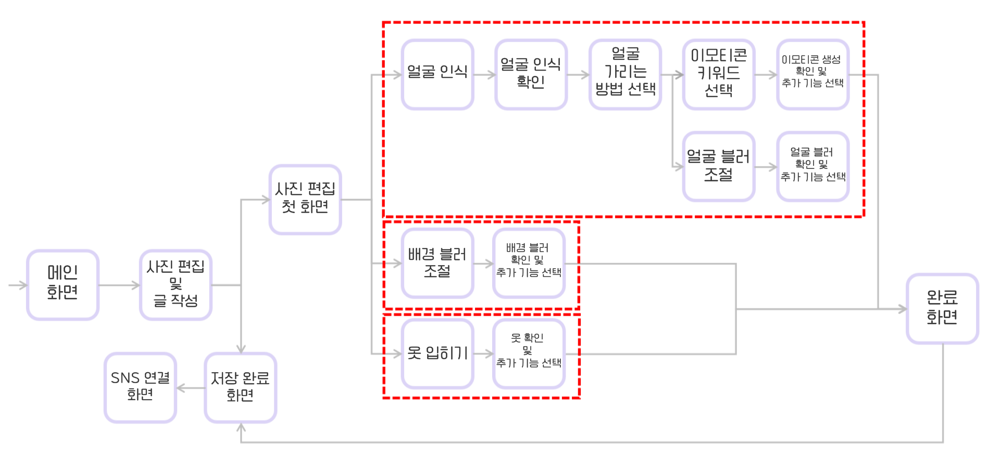
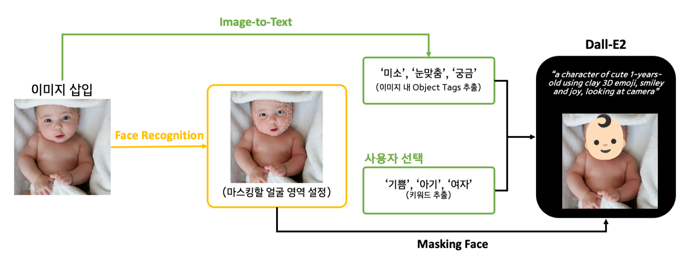
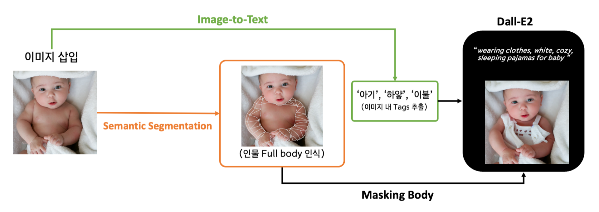

가리다(GaRiDa)는 안전한 SNS 사용을 위한 개인정보 마스킹 어플입니다.

생성형 이미지를 통해 사진의 이질감을 줄여주는 자연스러운 얼굴 마스킹으로 본인 뿐만 아니라 사진에 나온 다른 얼굴을 가리는데 편리함을 주고자 하였습니다.@

<br/>

## 1. 프로세스

기능을 설명하기 앞서, 앱 서비스의 전체 프로세스를 간략하게 설명하자면,  
메인화면에서 사진 편집 및 글 작성하는 화면으로 간 후, 얼굴인식, 배경 블러 조절, 옷 입히기를 선택할 수 있는 페이지로 이동합니다.  
그리고 각 기능에서 원하는 방법으로 개인정보를 마스킹 해 최종적으로 SNS에 공유할 수 있는 SNS 연결화면으로 넘어가는 프로세스를 갖추고 있습니다.


<br>

## 2. 주요 기능

### 얼굴 이모지 생성 마스킹 기능

이미지 내 얼굴을 인식해 감정, 성별, 이모지 스타일 등을 반영한 이모티콘을 생성해 얼굴을 마스킹합니다.  
Face Recognition, Face Alignment, Prompt Engineering을 활용하였고 각 기술의 적용 흐름은 플로우 차트에 따라 기획하였습니다.


**적용방안**

- 마스킹하고자 하는 얼굴 영역을 선택하기 위해 Face Recognition 적용
- 삽입한 이미지를 Image-to-Text를 활용해 이미지 내 object에 대한 키워드 태그 추출
- 사용자에게 입력받은 키워드와 추출한 키워드 기반으로 생성한 prompt로 Dall-E2를 활용해 마스킹 이모티콘 생성

<br>

### 다양한 의류 이미지 생성

이미지 내 인물의 옷을 찾아 이미지의 분위기나 인물의 상황을 반영해 다양한 의류로 변경할 수 있는 기능입니다.  
Semantic Segmentation, Prompt Engineering을 활용하였고 다음과 같은 플로우 차트에 따라 기획하였습니다.



**적용방안**

- Semantic Segmentation을 사용해 사람의 Full body 인식
- 이미지의 분위기와 인물의 상황을 반영하기 위해 Image-to-Text 사용
- 이미지 내 추출한 Tag 기반으로 생성한 prompt와 Dall-E2를 통해 인물의 Full body를 마스킹할 의상 이미지 변환해 출력

<br>

## 3. 활용 기술

이러한 아이디어를 실현시키기 위해 MediaPipe, Grounded-SAM, Dall-E2를 이용하였습니다.

### MediaPipe

BlazeFace 모델을 기반으로 다양한 이미지, 영상 데이터를 처리할 수 있도록 지원하고 있습니다.  
실시간으로 얼굴의 특징과 눈, 코입 부위를 분할할 수 있고 CPU만으로도 가볍게 사용할 수 있어 가리다(GaRiDa) 앱 개발에 적합하다고 판단해 사용하였습니다.

저희 팀이 구현한 코드에서 랜덤 이미지를 돌렸을 때 71.4%의 인식률을 보였습니다.

### Grounded-SAM

그라운딩 디노는 얼굴, 손과 같이 특정 텍스트를 입력하면 해당 객체를 박스 형태로 인식합니다.  
Segment Anything은 박스 형태의 객체에서 정확하게 객체를 인식합니다.

이러한 두 기능을 사용한 Grounded-SAM은 개체를 탐지하고 세분화하는 모델입니다. 얼굴이나 손과 같이 원하는 객체를 인식 후 경계를 분리해줍니다.

저희 팀이 랜덤 이미지로 인식률을 테스한 결과 51.7%의 정확도를 보였습니다.

### Dall-E2

Open AI에서 발표한 Dall-E2는 텍스트 프롬프트를 받아들여 텍스트를 시각적으로 묘사하는 새로운 이미지를 생성하는 딥러닝 모델입니다.

<br>

다음 글에서는 가리다(GaRiDa) 어플의 **프로토타입**을 소개해드리겠습니다.

```toc

```
