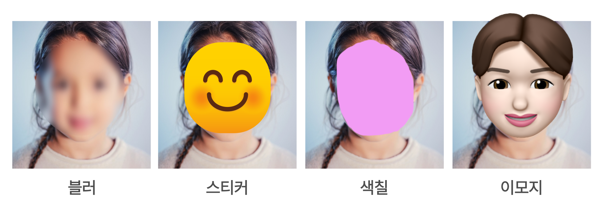
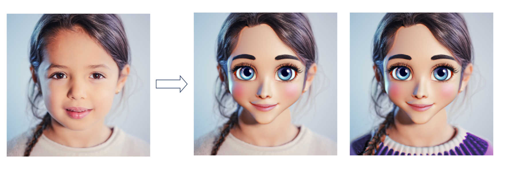
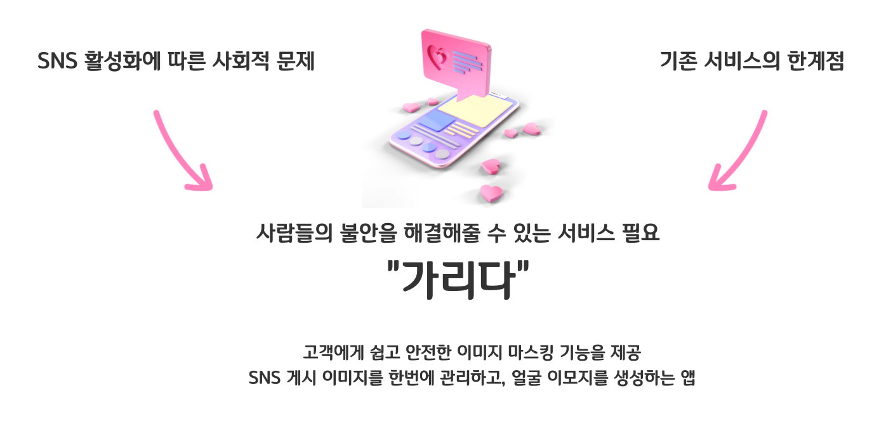

가리다(GaRiDa)는 안전한 SNS 사용을 위한 개인정보 마스킹 어플입니다.

생성형 이미지를 통해 사진의 이질감을 줄여주는 자연스러운 얼굴 마스킹으로 본인 뿐만 아니라 사진에 나온 다른 얼굴을 가리는데 편리함을 주고자 하였습니다.@

<br/>

## 주제 선정 배경

최근 사회적으로 SNS의 사용 인구가 증가하며 자신의 일상을 불특정 다수와 공유하는 서비스 이용자들이 늘어나고 있는 추세입니다.  
이러한 SNS에서 육아를 공유하는 부모를 일컫는 셰어런팅 이용자 또한 증가하며 자녀나 자녀의 어린 친구들의 개인정보 자기 결정권과 같은 침해 위험이 높아지고 있는 것을 알 수 있었습니다.  
그리고 다양한 설문 통계자료를 통해 SNS 생활에서 개인정보 기반 스토킹, 유출 위험성에 대한 pain point를 확인할 수 있었습니다.

그에 비해 기존 서비스들에는 한계가 있었습니다.  
마스킹 어플을 추가적으로 사용해야 하고, 자동 모자이크 영역과 개수가 한정되어 있으며  
또는 모자이크할 영역을 유저가 직접 드래그해 채워야 하는 불편함이 존재했습니다.

우선 기존의 **일반적인 방식**으로 얼굴을 마스킹한 이미지입니다.

사진의 분위기를 해치거나 어색하다고 느끼실 것 같습니다.

이러한 부분들을 보완하기 위해 저희는 사진의 분위기를 유지하면서 얼굴을 가려주는  
**새로운 얼굴 마스킹 방식**을 생각했습니다.

이 사진을 보시면

얼굴이 자연스럽게 마스킹된 것을 볼 수 있습니다.  
그리고 얼굴 뿐만이 아니라 보라색 옷으로 바꿔주는 것도 보실 수 있습니다.

이처럼 기존 서비스들과의 차별점으로 이미지 인식 모듈을 이용하여 간편하게 배경을 흐리게 하여 위치 정보를 보호하는 기능을 구현하고자 하였습니다.  
얼굴을 인식하여 원하는 느낌의 표정 이모티콘을 생성함으로써 개인정보 보호를 쉽고 재밌게 할 수 있고, SNS에 사진을 바로 옮겨 게시할 수 있음으로써 사용자의 편리함이 증대되는 차별성을 두었습니다.

<br>

**이렇듯 SNS 활성화에 따른 사회적 문제와 기존 서비스의 한계점으로 인해 사람들의 불안을 해결해줄 수 있는 서비스가 필요하다고 생각하여 가리다(GaRiDa)를 개발하게 되었습니다.**

<br>

다음 글에서는 가리다(GaRiDa) 어플의 **주요 기능**에 대해 소개해드리겠습니다.

```toc

```
