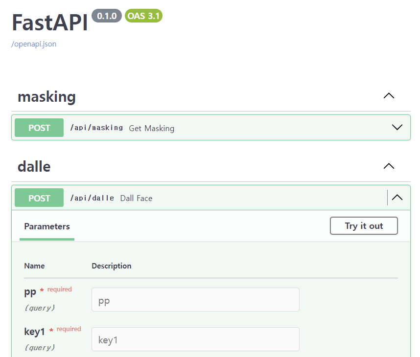

가리다(GaRiDa)는 안전한 SNS 사용을 위한 개인정보 마스킹 어플입니다.

생성형 이미지를 통해 사진의 이질감을 줄여주는 자연스러운 얼굴 마스킹으로 본인 뿐만 아니라 사진에 나온 다른 얼굴을 가리는데 편리함을 주고자 하였습니다.@

<br/>

## 사용 언어 및 도구

- 협업 툴 : Notion
- 프론트엔드 개발 툴 : Flutter
- 백엔드 개발 툴 : Docker, FastAPI

<br>

## MVP

- 가리다(GaRiDa) 프로토타입 : <a href="https://www.figma.com/proto/yW2vZww4Cu4iIp7IGsyRwy/%EA%B0%80%EB%A6%AC%EB%8B%A4(GaRiDa)-%ED%94%84%EB%A1%9C%ED%86%A0%ED%83%80%EC%9E%85?page-id=0%3A1&type=design&node-id=1-2779&viewport=526%2C365%2C0.09&t=n4hVTIITBt31pVWq-1&scaling=min-zoom&starting-point-node-id=1%3A2779&mode=design" target="_blank"> Figma </a>
- 가리다(GaRiDa) 프로토타입 레포지토리 : <a href="https://github.com/i4-AI-for-Security/GaRiDa-prototype" target="_blank"> Github Prototype Repository </a>

<br>

## 프로토타입

아직 가리다(GaRiDa) 어플 개발을 다 끝내지 못했습니다.  
그렇기에 일단 진행한 단계까지의 코드를 깃허브에 올려두었습니다.

- 가리다(GaRiDa) 프론트엔드 레포지토리 : <a href="https://github.com/i4-AI-for-Security/GaRiDa-frontend" target="_blank"> Github FE Repository </a>
- 가리다(GaRiDa) 백엔드 레포지토리 : <a href="https://github.com/i4-AI-for-Security/GaRiDa-backend" target="_blank"> Github BE Repository </a>

<br>

## 백엔드 실행 방법

우선, Docker 프로그램을 실행합니다.

그리고, 백엔드 레포지토리에 main.py 파일이 있습니다.

```python
@ app.post("/api/dalle", tags=["dalle"])
async def dall_face(pp,  key1, key2, key3, key4):
    start = time.time()

    mask_img = './img_file/masking_img/mask_'+pp+'.png'
    in_img = './img_file/in_img/in_'+pp+'.png'

    openai.api_key = "enter the open ai key value"
```

main.py에서 `openai.api_key = "enter the open ai key value"`의 enter the open ai key value에는 OpenAI에서 받으신 key를 입력하시면 됩니다.

그리고 콘솔창에서

```
docker build -t test-dalle .
```

를 입력하고

```
docker run -p 8080:8080 test-dalle
```

를 입력한 후  
`http://localhost:8080/docs#/dalle/dall_face_api_dalle_post` 이 링크로 이동하면



이렇게 작동되는 것을 확인할 수 있습니다.
