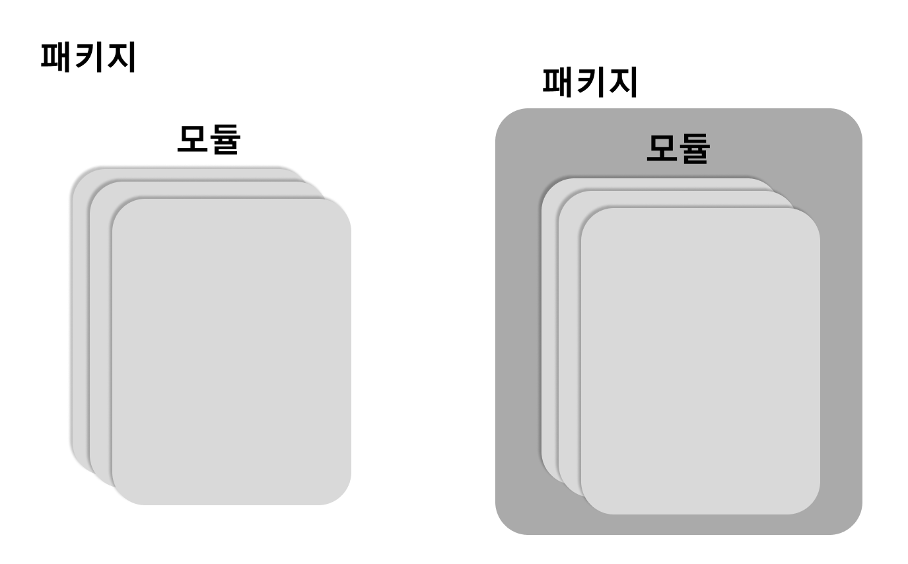

함수들이 뭉쳐진 하나의 .py 파일 안에 이루어진 것을 모듈이라고 한다.@

<br>

## 1. 패키지와 모듈, 함수의 관계도

**모듈**이란 변수, 함수, 클래스 등을 모아 놓은 파일이다.  
모듈에 정보를 한번만 정의해두면 여러 프로그램에서 쉽게 가져다 쓸 수 있다.

여러 개의 모듈을 **그룹화**하면 패키지가 된다.  
패키지는 종종 **라이브러리**라고도 불린다.



<br>

## 2. 모듈 import 하기

### 1) import는 왜 할까?

**import**는 파이썬의 유용한 기능 중 하나다.  
import는 다른 사람이 이미 만들어 놓은 좋은 모듈을 쉽게 가져다 쓸 수 있다.

<br>

### 2) import 하는 방법

.py(파이썬 파일 확장자)로 된 파일을 모듈이라고 한다.  
import 구문을 통해 해당 파일을 불러올 수 있다.

```python
import pandas
```

<br>

## 3. 별칭(alias) 지어주기

pandas라는 패키지 이름이 너무 길기에 **약어**로 줄여쓸 수 있다.  
보통 pd를 보편적으로 많이 사용한다.

```python
import pandas as pd
```

<br>

## 4. 주로 많이 사용하는 패키지

- **numpy** : 과학 계산을 위한 패키지

- **pandas** : 데이터 분석을 할 때 가장 많이 쓰이는 패키지

- **matplotlib** : 시각화를 위한 패키지

- **seaborn** : 시각화를 위한 패키지(matplotlib을 더 쉽게 사용할 수 있도록 도와주는 패키지)

```toc

```
