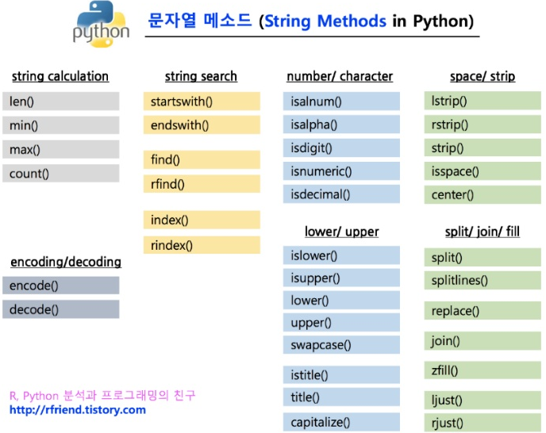

문자열 연산은 리스트 연산과 유사하다.  
다만 문자열은 immutable(변경 불가능)이라는 특성만 주의하면 된다.@

<br>

## 1. 문자열 연산

문자열끼리의 덧셈은 **문자열 연결**이다.  
문자열과 정수의 곱셈은 **문자열의 반복**이다.

```python
a = 'python'
b = ' World'
print(a)
print(b)

print(a+b)

print(a*2)
new_a = a*2
print(new_a)
```

```powershell
python
 World
python World
pythonpython
pythonpython
```

<br>

## 2. in 조건문

```python
print('p' in 'python')
print('a' in 'python')

# 반복문을 사용할 수도 있다
is_found = False

for i in 'python':
    if 'p' == i:
        is_found = True
        break

print(is_found)
```

```powershell
True
False
True
```

<br>

## 3. 문자열 관련 멤버 함수(method)

count( ) 메쏘드는 파라미터가 **문자열에 존재하는 갯수**를 반환한다.  
count( ) 메쏘드를 사용하지 않으면 반복문을 사용할 수 밖에 없다.

```python
a = 'Hello Python'
print(a.count('o'))

my_count = 0
for i in a:
    if i == 'o':
        my_count += 1

print(my_count)
```

```powershell
2
2
```

<br>

count( ) : 파라미터 값의 존재 **횟수** 반환  
find( ) : 파라미터 값이 있는 **위치** 반환, **없을때는 -1** 반환  
index( ) : 파라미터 값이 있는 **위치** 반환, **없을때는 error** (파라미터 값이 문자열에 존재함을 가정)

문자열의 index( ) 메쏘드를 사용하려면 먼저 in으로 검사하고 사용한다.

upper( ) : **대문자**로 변경된 새로운 문자열 반환  
lower( ) : **소문자**로 변경된 새로운 문자열 반환



<br>

## 4. 빈칸 정리 메쏘드

```python
# 공백 정리
print("   -python-   ".lstrip()) # left strip
print("   -python-   ".rstrip()) # right strip
print("   -python-   ".strip())  # strip
```

```powershell
-python-
   -python-
-python-
```

```python
# replace() 메쏘드

print("I love python".replace("I", "You"))
```

```powershell
You love python
```

<br>

## 5. join과 split 메쏘드

split( ) 메쏘드는 해당하는 파라미터를 기준으로 문자열을 **단어별로 구분**해서 리스트로 반환한다.

```python
print("I love python".split())
print("I_love_python. You will do too".split('_'))
```

```powershell
['I', 'love', 'python']
['I', 'love', 'python. You will do too']
```

<br>

join( ) 메쏘드는 파라미터로 리스트를 받아서 이를 **연결한 문자열**을 반환한다.

```python
print(" ".join(word_list))
print(type(" ".join(word_list)))
```

```powershell
I love python
<class 'str'>
```

```toc

```
