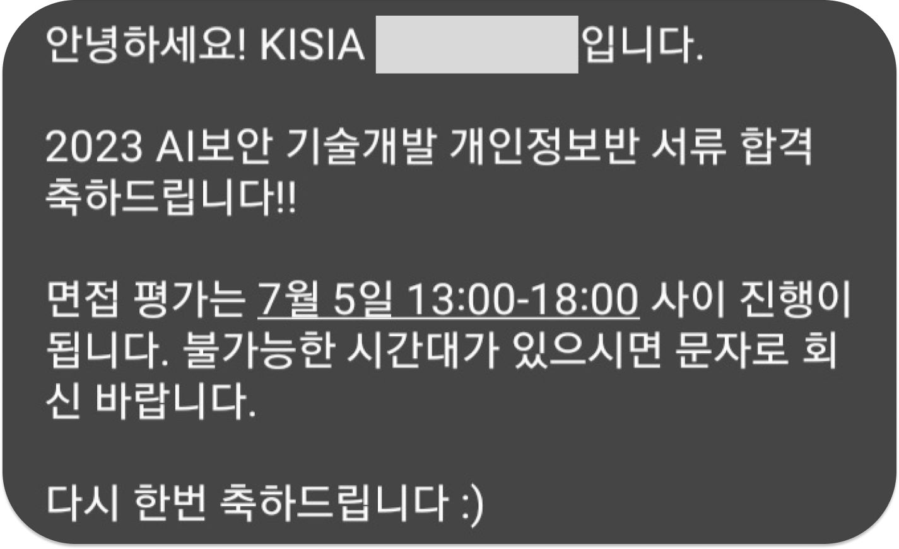
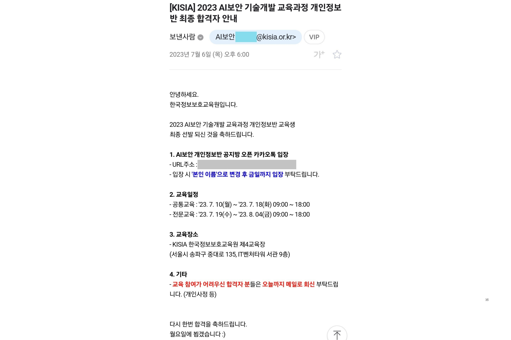

보안에 대해서 관심이 있어왔고 학교 수업으로 배우기 부족해 독학으로 공부했지만 부족하다고 느껴 여러 대외활동을 찾아봤었다.

더군다나 보안 관련 대외활동은 많지 않기에 막막했는데 마침 KISIA(한국정보보호산업협회)에서 AI 보안 기술개발 교육과정이 열린다는 것을 보고 지원하게 되었다.@

## 1. AI보안 기술개발 교육과정

우선 교육과정에 대해 설명하자면 AI 보안 기술개발 교육과정은 악성코드, 네트워크, 개인정보반으로 나눠진다. 개인정보반은 내가 들어갔을 당시 처음으로 생긴 반이였다.  
나는 그중 개인정보반을 신청했고 감사하게도 합격을 하게 되어 한 달동안 교육을 받고 프로젝트까지 해서 교육과정을 수료했다.

교육은 공통 교육과 심화교육으로 이루어진다.  
공통교육은 6일정도 진행되었고 7일차에 중간 평가를 본다.  
공통교육은 악성코드, 네트워크, 개인정보반 모두 동일한 교육을 배우는 것 같았고, 심화교육은 각 반의 내용에 맞춰 진행되는 것 같았다.  
심화교육은 12일간 진행되었고 마지막 날에 기말 평가를 봤다.

교육은 모두 오프라인으로 들었고 경찰병원역 바로 앞에 있는 건물과 교육원에서 수강했다.

기말 평가까지 다 보면 프로젝트에 들어가게 된다.  
주제는 "AI 기술을 활용한 개인정보 탐지모델 개발"였다.  
멘토님도 각 팀별로 한 분씩 연결해 주는데 우리 팀은 카카오뱅크에서 일하시는 전문가 멘토님을 연결해 주셨다. 멘토님은 정말 좋은 분이셨는데 멘토링도 정말 자주 해주셨고 주제에 대한 방향성과 프로젝트 진행과정도 점검해주시고 모르는 부분을 카톡으로 여쭤보면 답도 너무 자세히 해주고 모르는 부분을 어떻게든 도와주실려고 하주셔서 프로젝트를 진행할 때 큰 도움이 되었다.

## 2. 지원서 및 면접

**1) 지원서**

지원서는 간단한 이력사항을 기재할 수 있는 항목과 자기소개서로 구성되어 있었다.

1. 역량 분야 기입  
   어떤 언어를 사용할 수 있는지(JAVA, C언어 등), 어느 정도로 다룰 수 있는지 정도를 작성했다.

2. 지원동기(500자)  
   학교에서 개발과 코딩은 많이 배울 수 있었지만 AI와 보안에 관한 수업이 부족해 배우고 싶어 지원하게 되었다는 내용을 적었다.

3. 성격의 장단점(500자)  
   장점은 ~~이지만 이런 장점은 단점이 되기도 합니다. 그래서 단점을 보완하기 위해 ~~~한 노력을 하고 있다는 식으로 작성했다.

서류 합격은 모집일 다음날 오후 5시에 문자/메일로 왔었다.

**2) 면접**

면접은 한국정보보호산업협회 건물에서 진행되었고 대기실과 면접실은 따로 있었다. 복장은 단정하게 보일 수 있는 정도의 옷을 입고 갔다. (정장 입고 오신 분들도 계시기는 했다.)

면접은 면접관님 4분, 지원자 4명이 들어가서 면접을 보았다. 면접 질문은

1. 간단한 자기소개
2. 개인정보반에 지원하게 된 이유
3. 지원한 분야에 대해 따로 공부했거나 프로젝트를 해본 경험이 있는지
4. 진로가 무엇인지
5. AI 보안에 대해서 아는게 있는지
6. 생성형 AI란 무엇인가
7. 교육 진행 과정에서 생길 수 있는 어려운 점은 어떤 것이 있을거라 생각하는지

다 기억이 나지 않지만 저정도의 질문들을 하셨던 것 같다.
압박면접은 아니였지만 면접은 면접이였기에 긴장을 했지만 모든 질문에 성실히 답했고, 하고자 하는 의지를 보였기에 면접관님들께서 좋게 봐주셨던 것 같다.  
최종 합격 결과는 면접 본 다음 날 오후 6시에 왔고 최종 합격하였다.

